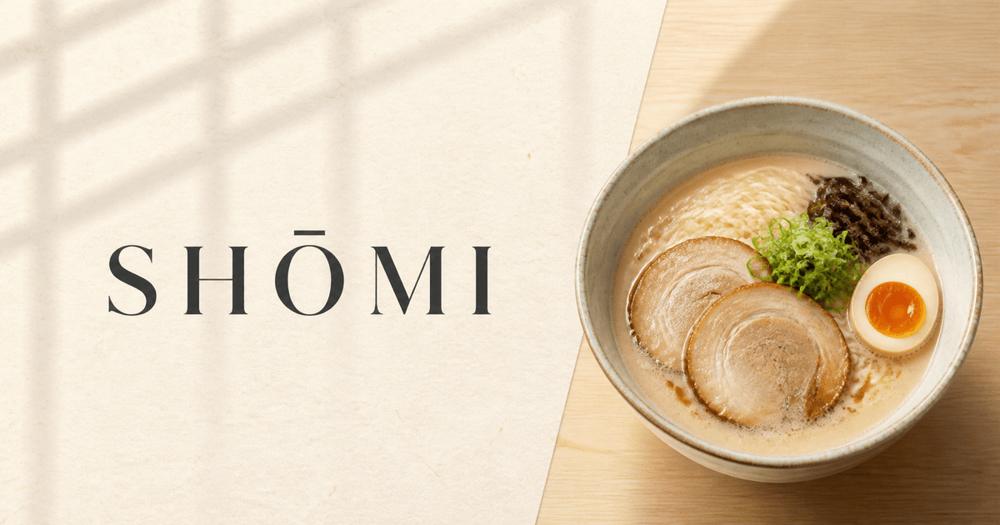

# 赏味 SHŌMI｜豚骨拉面

一个以图片、文字与滚动交互呈现食物风味的网页体验。第一席从日式豚骨拉面开始：浏览者随页面下滑完成十五帧进食过程，在面条、溏心蛋、叉烧与最后一口汤之间，逐步感受香气、味觉、口感和身体状态的变化。



## 在线体验

[打开赏味豚骨拉面](https://shomi-tonkotsu-ramen.zhuby933.chatgpt.site/?transition=shoji#top)（当前为私有站点）

[GitHub Pages 公开体验](https://kie70.github.io/shomi-tonkotsu-ramen/?transition=shoji#top)

可通过地址参数直接体验两套帧切换方式：

- `?transition=shoji`：障子推拉切，使用无透明叠化的横向揭幕效果。
- `?transition=washi`：和纸翻页切，以轻量页边和透光纹理完成画面交接。

## 主要特性

- 十五帧豚骨拉面进食分镜，从完整上桌到空碗余味。
- 固定于画面安全区的风味气泡，以细腻文字描述每一口的变化。
- `饱、暖、渴、残量` 四项身体状态随进食阶段同步更新。
- 三缓冲图片渲染：目标图片完成解码后才切换，避免闪白和纯色空帧。
- 障子推拉与和纸翻页两套日系切换动效，可在页面顶栏即时比较。
- 桌面端采用完整场景构图，移动端改为图片与文字上下分区。
- 支持 `prefers-reduced-motion`，在减少动态效果模式下无痕硬切。

## 本地运行

环境要求：Node.js `22.13` 或更高版本。

```bash
npm install
npm run dev
```

浏览器打开终端给出的本地地址即可预览。

常用命令：

```bash
npm run lint
npm run build
npm run start
```

## 项目结构

```text
app/
  page.tsx       页面内容、十五帧数据与滚动交互
  globals.css    场景布局、气泡、状态栏与切换动效
  layout.tsx     页面元数据与全局布局
public/
  images/        校色后的 WebP 分镜素材与首帧占位图
  og.png         项目预览图
```

## 技术栈

- React 19
- Next.js 16
- Vinext
- TypeScript
- CSS 动画与响应式布局

## 设计方向

界面以干净、安静的日式木屋为视觉基调。图片主体集中在画面右侧，左侧保留和纸气泡的阅读空间；动效追求克制和连贯，让文字与食物变化共同承担“品尝”的叙事。
